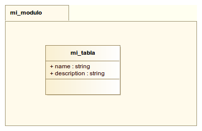

## Estructura básica de un módulo

El módulo de OpenERP tiene la siguiente estructura básica:

    \-- addons
       \-- mi_modulo
         |-- __init__.py
         |-- __openerp__.py
         |-- mi_modulo.py
         |-- mi_modulo_view.xml

* **`__init__.py`**: Define el paquete python. El archivo incluye los modulos que hacen parte del paquete.

        import mi_modulo

* **`__openerp__.py`**: Define los metadatos del modulo openerp.

        {
            "name" : "mi_modulo",
            "version" : "1.0",
            "author" : "xx",
            "category" : "xx",
            "description" : "xx",
            "init_xml" : [],
            "depends" : ['base',],
            "update_xml" : ['mi_modulo_view.xml',],
            "active" : False,
            "installable" : True,
        }

    * **name**: Nombre del módulo en OpenERP
    * **init_xml**: Archivos xml/csv a ser cargados en el momento de la instalación del módulo, veremos más adelante archivos que pueden ser cargados (ej. datos, vistas, flujos de trabajo)
    * **depends**: Listar los módulos que deben estar instalados en el sistema previamente
    * **update_xml**:  Archivos xml/csv a ser cargados en el momento de la actualización del módulo (ej. datos, vistas, flujos de trabajo)

* **`mi_modulo.py`**: Módulo python que contiene los objetos de negocio de nuestro módulo

        from osv import fields, osv

        class mi_modulo_mi_tabla(osv.osv):
            _name = "mi_modulo.mi_tabla"
            _columns = {
                'name' : fields.char('nombre',size=255),
                'description' : fields.char('descripcion',size=255),
            }
        mi_modulo_mi_tabla()

* **`mi_modulo_view.xml`**: Archivo XML que contiene la definición de las vistas y menús a ser cargados

        <?xml version="1.0"?>
        <openerp>
        <data>
            <record model="ir.ui.view" id="mi_modulo_mi_tabla_form">
                <field name="name">mi_modulo.mi_tabla.form</field>
                    <field name="model">mi_modulo.mi_tabla</field>
                    <field name="type">form</field>
                    <field name="arch" type="xml">
                        <form string="mi_modulo mi_tabla">
                            <field name="name"/>
                            <field name="description"/>
                        </form>
                  </field>
            </record>
            <record model="ir.ui.view" id="mi_modulo_mi_tabla_tree">
                <field name="name">mi_modulo.mi_tabla.tree</field>
                <field name="model">mi_modulo.mi_tabla</field>
                <field name="type">tree</field>
                <field name="arch" type="xml">
                    <tree string="mi_modulo mi_tabla">
                        <field name="name"/>
                        <field name="description"/>
                    </tree>
                </field>
            </record>
            <record model="ir.actions.act_window" id="action_mi_tabla_seq">
                <field name="name">Mi Tabla</field>
                <field name="res_model">mi_modulo.mi_tabla</field>
                <field name="view_type">form</field>
                <field name="view_mode">tree,form</field>
            </record>
            <menuitem id="menu_mi_modulo_module" name="Mi Modulo"/>
            <menuitem id="menu_mi_modulo_tables" name="Mi Modulo" parent="menu_mi_modulo_module"/>
            <menuitem id="menu_mi_modulo_mi_tabla" parent="menu_mi_modulo_tables" name="Mi Tabla" action="action_mi_tabla_seq"/>
        </data>
        </openerp>

## Instalación del módulo

1. Para instalar el módulo este debe estar disponible en la carpeta addons de openerp, se pueden utilizar varias carpetas addons en una instalación de OpenERP, las carpetas se definen en el archivo de configuración *openerp-server.conf* en el parametro *addons_path*, ejemplo:

    [options]
    db_host = False
    db_port = False
    db_user = openerp
    db_password = False
    addons_path = /usr/share/pyshared/openerp/addons/,/opt/openerp-idu-addons/src

1. Luego se reinicia el servidor y para que se registre el nuevo módulo en la base de datos se entra como administrador en la opción *configuración -> actualizar lista de módulos -> actualizar* (solo esta disponible si tiene la opción de interfaz extendida en sus preferencias de usuario). Esto hace que aparezca el nuevo módulo en el listado para ser instalado.

1. Para instalar el módulo en la base de datos debe ingresar como administrador en la opción *Configuración -> módulos*, luego activa la opción *extra* y coloca el nombre del nuevo módulo a instalar y presiona enter, luego hace click en el botón *instalar*, la interfaz se recargará y el menú del módulo aparecerá en la interfaz.

## Generación de un módulo a partir de un diagrama UML

Actualmente se encuentra en desarrollo la herramienta [xmi2openerp](https://github.com/andresc1125/xmi2openerp) que permite la generación de módulos OpenERP a partir de un modelo XMI. La herramienta se ha probado con modelos realizados con la herramienta [Modelio](http://www.modelio.org/).

Como ejemplo el diagrama UML  se convierte en un módulo OpenERP con el siguiente comando:

    xmi2openerp ~/git/curso-taller-openerp/lecciones/01/curso_taller_openerp.xmi

El comando creará la estructura básica del módulo que incluye modelos y vistas, las cuales puede entrar a modificar acordemente a sus necesidades.