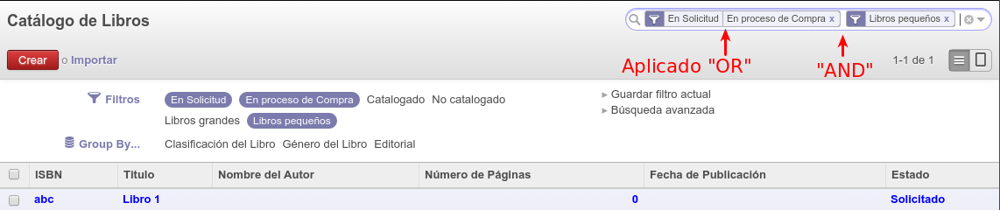

Lección 05: Dominios, Busquedas, Filtros y Agrupamientos
========================================================

[TOC]

Dominios
--------

Los dominios en Odoo son utilizados para filtrar los registros a los que se tiene acceso en las vistas o en consultas dentro del código del Modelo.

Estos dominios se pueden asimilar a las condiciones que se agregan en un WHERE en una sentencia SQL. Si para nuestro ejemplo de la biblioteca normalmente en SQL ejecutamos

	SELECT * FROM biblioteca_libre WHERE paginas > 100 AND nombre_autor ILIKE '%cervantes%'

en Odoo el dominio se estructuraría

	[('paginas','>',100),('nombre_autor','ilike','%cervantes%')]`

Un dominio es un listado de criterios, en el ejemplo anterior hay dos criterios, estos criterios estan formados por:

- **`Nombre del campo`** del Modelo sobre el cual se aplica el filtro.
- **`Operador`** a utilizarse para la búsqueda a realizar [=, !=, >, >=, <, <=, =?, =like, like, not like, ilike, not ilike, =ilike, in, not in, child_of](https://www.odoo.com/documentation/8.0/reference/orm.html#domains)
- **`Valor`**: Valor sobre el cual se compara para la búsqueda

Los criterios se pueden combinar utilizando operadores lógicos en [notación prefijo o polaca](http://es.wikipedia.org/wiki/Notaci%C3%B3n_polaca) usando los operadores siguientes:

- '&' AND, operador por defecto
- '|' OR
- '!' NOT

Para una consulta SQL como esta:

    SELECT * FROM biblioteca_libro WHERE paginas > 100 AND nombre_autor ILIKE '%cervantes%' OR nombre_autor ILIKE '%marquez%'

El dominio sería:

    [('paginas','>',100),'|',('nombre_autor','ilike','%cervantes%'),('nombre_autor','ilike','%marquez%')]

Búsquedas
---------

Las búsquedas (search) son un tipo de vista que se asocia a un Modelo con el objeto de permitir realizar búsquedas por campos especificos, adicionar filtros predeterminados y agrupaciones sobre los registros que se despliegan en las vistas tipo listado. A continuación un ejemplo de una vista search.

    <record model="ir.ui.view" id="libro_search">
        <field name="name">biblioteca.libro.search</field>
        <field name="model">biblioteca.libro</field>
        <field name="arch" type="xml">
            <search>
                <field name="isbn" string="ISBN del libro"/>
                <field name="name" string="Título del libro"/>
                <separator string="Filtros por Estados"/>
                <filter name="solicitud" string="En Solicitud" help="Estado del regristro En progreso"
                    domain="[('state','=','solicitud')]"
                />
                <filter name="catalogado" string="Catalogado" help="Estado del registro Catalogado"
                    domain="[('state','=','catalogado')]"
                />
                <filter name="no_catalogado" string="No catalogado" help="Libros no catalogados"
                    domain="[('state','!=','catalogado')]"
                />
                <separator string="tamaño"/>
                <filter name="grandes" string="Libros grandes" help="Libros con más de 1000 páginas"
                    domain="[('paginas','>=',1000)]"
                />
                <filter name="pequenos" string="Libros pequeños" help="Libros con menos de 1000 páginas"
                    domain="[('paginas','&lt;',1000)]"
                />
                <group string="Group By...">
                    <filter string="Clasificación del Libro" context="{'group_by':'clasificacion'}"/>
                    <filter string="Género del Libro" context="{'group_by':'genero'}"/>
                    <filter string="Editorial" context="{'group_by':'editorial'}"/>
                    <filter string="Estado" context="{'group_by':'state'}"/>
                </group>
            </search>
        </field>
    </record>

- **Búsquedas por campos**: Para permitir la búsqueda por campos especificos del modelo solo se debe agregar una etiqueta `field` e indicar el nombre del campo por el cual que se pemite realizar la búsqueda. En el momento de escribir en el cuadro de búsqueda que aparece en la parte superior derecha, se va a desplegar un listado de los campos sobre los cuales se va a aplicar la búsqueda. Estas búsquedas son abiertas, ud define el valor por el cual buscar.

- **Filtros predeterminados**: estos son búsquedas predeterminadas que le usuario simplemente aplica haciendo clic sobre el filtro. Para adicionar un filtro necesita adicionar una etiqueta `filter` e indicar en el parámetro `domain` un dominio siguiendo la sintaxis vista en la sección anterior. Los filtros pueden agruparse utilizando la etiqueta `separator`, estos grupos sirven para indicar si al aplicar varios filtros se va a usar los operadores lógicos *AND* u *OR*. Si dos filtros aparecen en el mismo grupo se aplica *OR*, si estan en grupos aparte se aplica *AND*. Visualmente el cuadro de búsqueda en la interfaz web va a desplegar los filtros aplicados de manera separada si se usa un *AND* y unidos si se aplica *OR* tal como se muestra en la imagen a coninuación:

- **Agrupaciones**: Se pueden agrupar los registros por campos, estas agrupaciones son defidas con la etiqueta `filter` y el atributo `context` donde se incluye un diccionario con la clave `group_by` y el nombre del campo por el cual se va a agrupar.

(Mayor información acerca de las vistas tipo búsqueda en Odoo)[https://www.odoo.com/documentation/8.0/reference/views.html#search]

Ejercicios propuestos
---------------------

Tomando como base el código de la lección:

1. Cargue en el Odoo los datos del archivo [src/biblioteca/biblioteca_libro.csv](src/biblioteca/biblioteca_libro.csv), esto lo puede hacer a través del link *_importar_* que aparece en la vista de listado del Modelo *biblioteca.libro*. [Más información acerca de importar archivos .csv](https://www.odoo.com/documentation/8.0/reference/data.html#csv-data-files)
1. Utilizar las busquedas, filtros y agrupamientos ya programados para la lección.
1. Revise como se comportan los filtros de los grupos 'Estados' y 'Tamaños', luego del código de la vista elimine el separador `<separator string="tamaño"/>`, actualice el módulo y vea como se comportan los filtros ahora.
1. Selecciones varias opciones del formulario de búsqueda, luego use la opción llamada *Guardar Filtro Actual* y active la opción *Usar por defecto*. Haga click en el menuitem *Libros* para ver como siempre se aplica el filtro guardado.
1. Utilice la opción llamada *Búsqueda Avanzada* en el formulario de búsqueda.
1. Cree una vista de búsqueda para el Modelo *biblioteca.prestamo*
